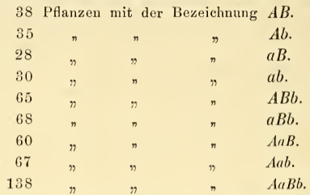
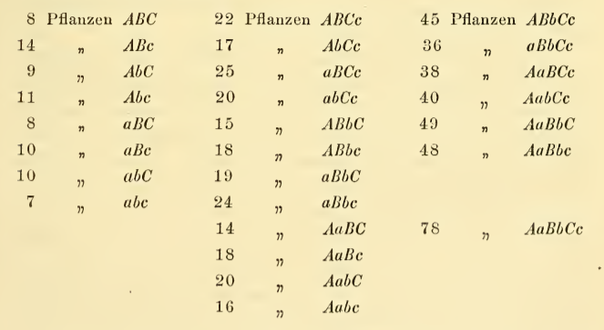

```{r setup, include=FALSE}
require(pander)
options(width=70)
knitr::opts_chunk$set(comment=NA, echo = FALSE)
pagebreak <- function() {
  if(knitr::is_latex_output()){return("\\newpage")} else {return('<div style="page-break-before: always;" />')}
}
panderOptions('table.continues', '')
panderOptions('table.split.table', 70)
panderOptions('digits', 3)
```

# Hey

- Knit this Rmd file to see if you can make a html or pdf. If you couldn't, just use RStudio Cloud or the Binder RStudio in the lab note homepage. Po loves RStudio. Everything you need is on the Cloud.

- Edit, add, delete the codes as you need. Delete and insert words/writings as you need.

`r pagebreak()`

# Codes in `LabAssignment4.Rmd`

```{r echo=TRUE}
Category <- c("AB","Ab","aB","ab",
              "ABb","aBb","AaB","Aab",
              "AbBb")
NullRatio <- c(1,1,1,1,
               2,2,2,2,
               4)
```

```{r echo=TRUE}
NullProportion <- NullRatio/sum(NullRatio) # converting ratios to proportions
Observed <- c(38,35,28,30,65,68,60,67,138) # from Mendel's table
Expected <-sum(Observed)*NullProportion # converting proportions to Expected counts
Discrepancy <- (Expected-Observed)^2/Expected
TestStat <- sum(Discrepancy) # chi-squared test statistic
p_value <- 1-pchisq(TestStat,9-1) # don't forget the degrees of freedom!
```

```{r}
ATable <- rbind(Category,NullRatio)
pander(ATable, caption="Relative ratios under the Null hypothesis")
```

```{r}
ATable <- rbind(NullProportion,Expected,Observed,Discrepancy)
pander(ATable,
      col.names=Category,
      caption="Observed vs. Expected values for Experiment 1")
```

{width=50%}


```{r,echo=FALSE}
Category <- c("ABC","ABc","AbC","Abc",
              "aBC","aBc","abC","abc",
              "ABCc","AbCc","aBCc","abCc",
              "ABbC","ABbc","aBbC","aBbc",
              "AaBC","AaBc","AabC","Aabc",
              "ABbCc","aBbCc",
              "AaBCc","AabCc",
              "AaBbC","AaBbc",
              "AbBbCc")
NullRatio <- c(1, 1, 1, 1,
               1, 1, 1, 1, 
               2, 2, 2, 2, 
               2, 2, 2, 2, 
               2, 2, 2, 2, 
               4, 4, 
               4, 4, 
               4, 4, 
               8)
ATable <- rbind(Category,NullRatio)
pander(ATable, caption="Relative ratios under the Mendel's proposal")
```

{width=50%}


`r pagebreak()`
# Appendix: R Script

```{r all-code, ref.label=setdiff(knitr::all_labels(), c("setup")), echo=TRUE, eval=FALSE}
```